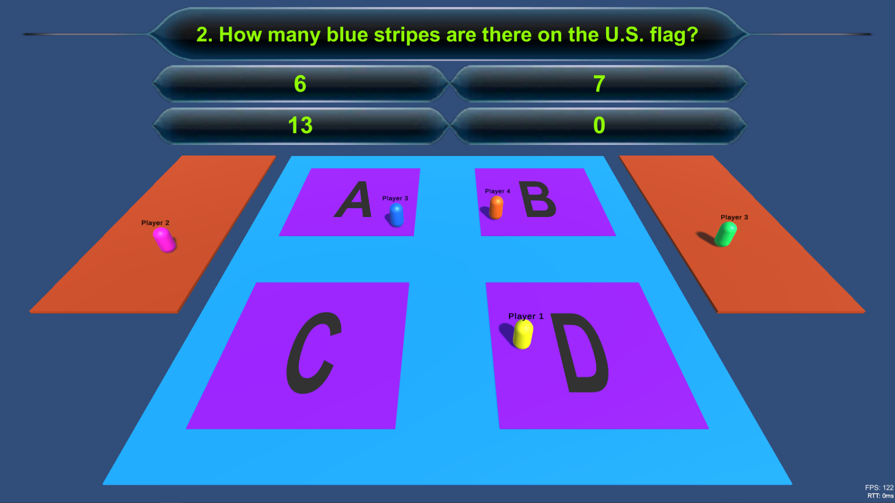

# MustyTrivia  
Unity Trivia Game Online (Steam)  

A Unity game that uses Steamworks API and Mirror packages to establish multiplayer experience.   
This is a trivia quiz game that you can play with your friends through Steam.

## Gameplay  
The aim of the game is to answer the trivia questions on the screen.  
Each player stands on the options they think is the right one.  

When answers are revealed, the platform for the false options break and the players who fall lose a live.  

Scene resets for the next question.  
The players who are out of lives go to the side platforms and spectate others.  

## How To Install  
Download and unzip the game.  
Go to Steam and select ADD A GAME on the bottom left corner of the Store window.  
Select Add a Non-Steam game.  
Select Browse and find the executable inside the unzipped game, under the Distributables folder.  
Start the game through Steam and enjoy.  

## Steam Lobby & Invites  
Once you run the game through Steam, you have access to the Steam overlay (by pressing Shift+Tab by default).
If you click the Host button on the main screen on the game, it will automatically create a Steam Lobby for you and will spawn a player with your Steam name.
After this, you can invite players through the Steam overlay, or they can directly join your lobby.
